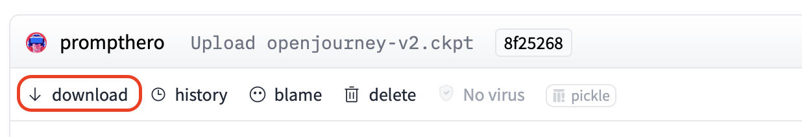
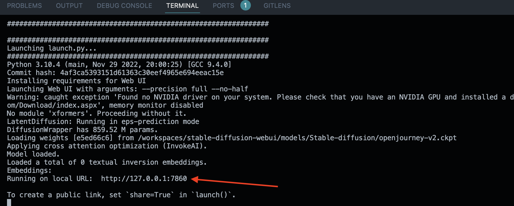

# How to run Stable Diffusion in GitHub Codespaces

Setup your own Stable Diffusion instance in the cloud to generate AI images in minutes using [GitHub Codespaces](https://github.com/features/codespaces). **You don’t need an expensive GPU or a fast internet connection.** Please read the FAQ and Disclaimer sections at the bottom before getting started.


## Getting Started

### Step 1: Create a Codespace

We'll be using [stable-diffusion-webui](https://github.com/AUTOMATIC1111/stable-diffusion-webui). With over 25k stars  and 280 contributers, this open source project is a good start that will work.

1. Navigate to the [AUTOMATIC1111/stable-diffusion-webui](https://github.com/AUTOMATIC1111/stable-diffusion-webui) repo. Click on the **Code** dropdown button, navigate to the **Codespaces** tab, and click **New with options...**
2. Leave everything as is, but change the machine type to **8-core • 16GB RAM • 64GB storage**. *This is the minimum machine type required to run Stable Diffusion. If you don't have this option, please read the FAQ below.*
3. Create codespace. This should launch a VS Code editor in a new tab.

### Step 2: Install dependencies

Install the libgl1 dependency in your new Codespace by executing the following command in your Codespace terminal.

- If you don't know how to open the terminal, click the burger icon in the top left corner, hover over **Terminal**, and click **New Terminal**. Paste the following command and press enter. This will download the required libgl1 package.

    ```
    sudo apt-get update && sudo apt-get install libgl1
    ```

### Step 3: Download a Stable Diffusion model

Next, we're going to download a stable diffusion model (a checkpoint file) from [HuggingFace](https://huggingface.co) and put it in the `models/Stable-diffusion` folder. These models are often big (2-10GB), so here's a trick to retrieve a checkpoint file and put it in your Codespace in seconds without using any of your internet bandwidth.

1. Find a model you want to use in HuggingFace. It could be the general purpose Stable Diffusion model [stabilityai/stable-diffusion-2-1](https://huggingface.co/stabilityai/stable-diffusion-2-1) or a fine-tuned model such as [prompthero/openjourney-v2](https://huggingface.co/prompthero/openjourney-v2).
2. Once you find a model you want to work with, click on the **Files and versions tab** and look for a file that ends with `.ckpt`. Click that file's link and you'll be navigated to the checkout file's page.
3. Right click the **download** link and copy the URL.

    
4. Back in your Codespace terminal, navigate to the `models/Stable-diffusion` folder and download the model to this folder using the following command.

    ```
    cd models/Stable-diffusion && wget https://huggingface.co/prompthero/openjourney-v2/resolve/main/openjourney-v2.ckpt
    ```
5. Navigate back to the root directory of the project.

    ```
    cd ../..
    ```

### Step 4: Launch the UI

Your setup is almost done! Use the command below in your Codespace terminal to launch the UI. It'll take a minute to install dependencies and launch the app.

```
./webui.sh --skip-torch-cuda-test --precision full --no-half
```

You'll get a link where the app is running. If you're on Windows, you can "ctrl + click" the link or if you're on Mac, you can "command + click" to open the link.



### Step 5 (Optional): Shutdown Codespaces

To save on resources, make sure to stop your Codespace instance once you're done using it. You can do this in the repo UI or using the [GitHub CLI tool](https://cli.github.com).

## FAQ

## Disclaimers
