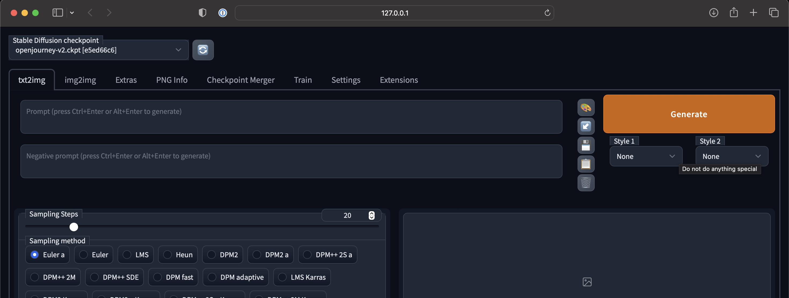

# How to run Stable Diffusion in GitHub Codespaces 🎨

Setup your own Stable Diffusion instance in the cloud to generate AI images in minutes using [GitHub Codespaces](https://github.com/features/codespaces). **You don’t need a powerful GPU or a fast internet connection.**


## Overview

- **⏱️ Estimated Setup Time**: 7 minutes
- 🐙 A GitHub account is required.
- 🤗 Beginner friendly. It helps to have some experience using a terminal, but it's not required.

## Getting Started

### Step 1: Create a Codespace

We'll be using [stable-diffusion-webui](https://github.com/AUTOMATIC1111/stable-diffusion-webui). With over 25k stars  and 280 contributers, this open source project is a good start that will work.

1. Navigate to the [AUTOMATIC1111/stable-diffusion-webui](https://github.com/AUTOMATIC1111/stable-diffusion-webui) repo. Click on the **Code** dropdown button, navigate to the **Codespaces** tab, and click **New with options...**
2. Leave everything as is, but change the machine type to **8-core • 16GB RAM • 64GB storage**. *This is the minimum machine type required to run Stable Diffusion. If you don't have this option, please read the FAQ below.*
3. Create codespace. This should launch a VS Code editor in a new tab.

### Step 2: Install dependencies

Install the libgl1 dependency in your new Codespace by executing the following command in your Codespace terminal.

- If you don't know how to open the terminal, click the burger icon in the top left corner, hover over **Terminal**, and click **New Terminal**. Paste the following command and press enter. This will download the required libgl1 package.

    ```
    sudo apt-get update && sudo apt-get install libgl1
    ```

### Step 3: Download a Stable Diffusion model

Next, we're going to download a stable diffusion model (a checkpoint file) from [HuggingFace](https://huggingface.co) and put it in the `models/Stable-diffusion` folder. These models are often big (2-10GB), so here's a trick to retrieve it and put it in your Codespace in seconds without using any of your internet bandwidth.

1. Find a model you want to use in HuggingFace. It could be the general purpose Stable Diffusion model [stabilityai/stable-diffusion-2-1](https://huggingface.co/stabilityai/stable-diffusion-2-1) or a fine-tuned model such as [prompthero/openjourney-v2](https://huggingface.co/prompthero/openjourney-v2).
2. Once you find a model you want to work with, click on the **Files and versions tab** and look for a file that ends with `.ckpt`. Click that model's link and you'll be navigated to that checkpoint file's page.
3. Right click the **download** link and copy the URL.

    
4. Back in your Codespace terminal, navigate to the `models/Stable-diffusion` folder and download the model to this folder using the following command.

    ```
    cd models/Stable-diffusion && wget https://huggingface.co/prompthero/openjourney-v2/resolve/main/openjourney-v2.ckpt && cd ../..
    ```

### Step 4: Launch the UI

Your setup is almost done! Use the command below in your Codespace terminal to launch the UI. It'll take a minute to install dependencies and launch the app.

```
./webui.sh --skip-torch-cuda-test --precision full --no-half
```

You'll get a link to the UI application in your terminal once everything is installed. If you're on Windows, you can "ctrl + click" the link. If you're on Mac, you can "cmd + click" to open the link.




### Step 5 (Optional): Stop Codespaces

To save on resources, make sure to stop or shutdown your Codespace instance once you're done using it. You can do this in the repo UI or using the [GitHub CLI tool](https://cli.github.com).

## FAQ

**Q. Is this free?**\
A. If you have a GitHub Pro account, you'll have access to the 8-core Codespaces machine type required for this. Otherwise, you'll have to setup billing for Codespaces. If you're a student, most universities will hook you up with a student developer account, which will enable you to have Pro enabled on your account.

**Q. Who is this guide for?**\
A. This is meant for people who want to use their own instance of Stable Diffusion (text-to-img, img-to-img, inpainting, etc) and who doesn't have a powerful computer or fast internet to follow the other existing local setup guides available.

**Q. Is my usage private?**\
A. Yes. Your Codespace instance is private to you.

**Q. Can't I just use Google Colab?**\
A. Sure, you can do that if it works for you. There are performance differences and some beginners might find Colab difficult to use, so this offers an alternative.

**Q. How long does it typically take to generate an image?**\
A. Since this method uses CPU and not GPU, I found that it usually takes 2-3 minutes for text-to-image generation.

**Q. Can I use a GPU in Codespaces instead?**\
A. Apparently it's possible to configure your Codespaces environment with a GPU (which should speed up performance considerably), but I've only done surface level research on this, which isn't included in this guide. Perhaps when I have more time I'll look into it and append instructions to this guide.

**Q. What if I want to use my own fine-tuned model that I have on my local machine, not one from HuggingFace?**\
A. You can drag and drop your model from your local computer to a folder in your VSCode editor. Please note that this means you'll be uploading a model to your Codespaces machine using your home internet. This may take longer depending on how fast your internet speed is.

**Q. Where can I find other fine-tuned ML models based on Stable Diffusion?**\
A. Explore HuggingFace https://huggingface.co/models?pipeline_tag=text-to-image&sort=likes or other similar services.

**Q. I have questions, who can I ask?**\
A. Please don't reach out directly. Either file an issue or create a new discussion in this repo with your question or comment.

## Disclaimer

*The information provided in this guide is intended for educational purposes only. This guide is not meant to be an endorsement or advertisement for GitHub Codespaces or AUTOMATIC1111's UI. It is simply intended to educate the community on how to run Stable Diffusion models in the cloud based on the limited research conducted. Please note that this may not be the optimal way to use Stable Diffusion, but it does provide an option for those with limited access to compute resources. Additionally, this tutorial is intended to follow the [terms of service of GitHub Codespaces](https://docs.github.com/en/site-policy/github-terms/github-terms-for-additional-products-and-features#codespaces).*
