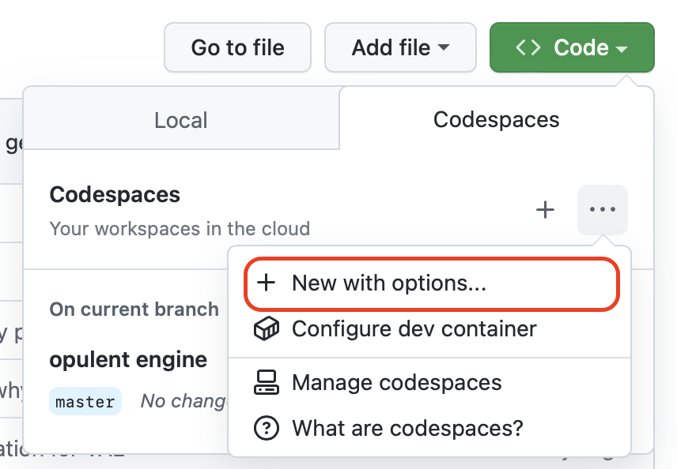
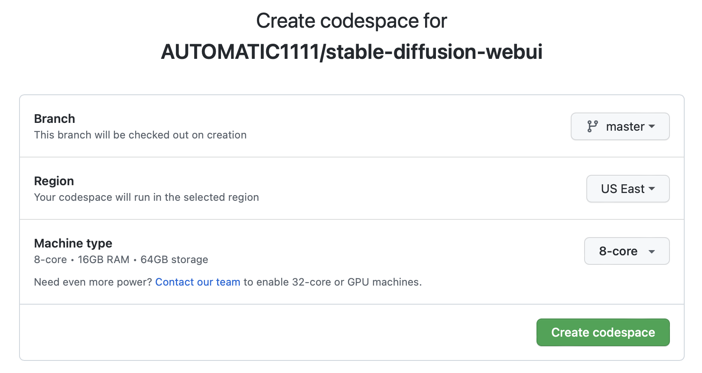

# How to run Stable Diffusion in GitHub Codespaces
Setup your own Stable Diffusion instance in the cloud to generate AI images in minutes using [GitHub Codespaces](https://github.com/features/codespaces). **You don’t need an expensive GPU or a fast internet connection.**


## Getting Started

### Step 1: Create a Codespace
We'll be using [AUTOMATIC1111/stable-diffusion-webui](https://github.com/AUTOMATIC1111/stable-diffusion-webui). You can use another UI, but this project has over 25k stars ⭐️ and 280 contributers, making it a good open source solution.

1. Navigate to [AUTOMATIC1111/stable-diffusion-webui](https://github.com/AUTOMATIC1111/stable-diffusion-webui), Click on the **Code** dropdown button, navigate to the **Codespaces** tab, and click **New with options...**

    

2. Leave everything as is, but change the machine type to the **8-core • 16GB RAM • 64GB storage** version.

    

3. Create codespace. This should launch a VS Code editor in a new tab.

### Step 2: Install libgl
```
sudo apt-get update && sudo apt-get install libgl1
```

### Step 3: Download model
Or if you have your own custom model, you can drag and drop. Retrieve a checkpoint file from HuggingFace. 
```
wget https://huggingface.co/prompthero/openjourney-v2/resolve/main/openjourney-v2.ckpt
```

### Step 4: Launch UI
```
./webui.sh --skip-torch-cuda-test --precision full --no-half
```

## FAQ

## Disclaimers
